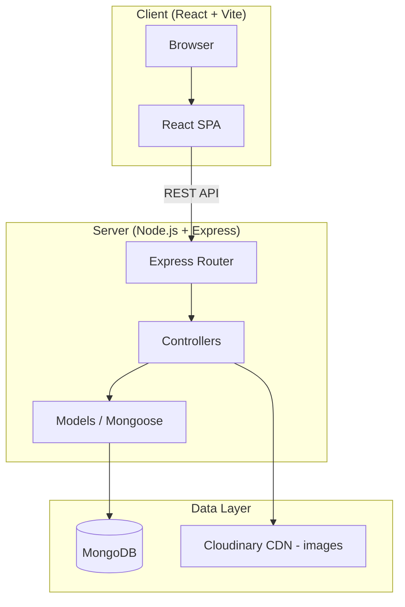

# Tripzybnb — Product Requirements Document

## 1. Problem Statement

Travelers need a centralized, intuitive platform to discover, compare, and book hotel rooms and vacation rentals. Existing solutions are either overly complex or lack modern aesthetics and smooth UX. **Tripzybnb** fills this gap by providing a clean, performant Airbnb-style booking experience focused on hotels and rooms.

## 2. Target Users

| Persona      | Description                                                    |
| ------------ | -------------------------------------------------------------- |
| **Traveler** | Searches listings, books rooms, leaves reviews                 |
| **Admin**    | Creates/manages listings, monitors bookings, moderates reviews |

> [!NOTE]
> For MVP, there is no "host" role — admins manage all listings directly.

## 3. System Architecture



**Key architectural decisions:**

- **Monorepo** with `client/` and `server/` directories
- **JWT-based auth** with httpOnly cookies
- **Multer + Cloudinary** for image uploads (with local fallback for dev)
- **Mongoose** as ODM for schema validation

---

## 4. Database Schema

### 4.1 `users` Collection

| Field       | Type     | Notes                                   |
| ----------- | -------- | --------------------------------------- |
| `_id`       | ObjectId | Auto                                    |
| `name`      | String   | Required                                |
| `email`     | String   | Required, unique, indexed               |
| `password`  | String   | Bcrypt hashed                           |
| `role`      | String   | `"user"` \| `"admin"`, default `"user"` |
| `avatar`    | String   | URL                                     |
| `createdAt` | Date     | Auto                                    |

### 4.2 `listings` Collection

| Field              | Type       | Notes                          |
| ------------------ | ---------- | ------------------------------ |
| `_id`              | ObjectId   | Auto                           |
| `title`            | String     | Required                       |
| `description`      | String     | Required                       |
| `location.city`    | String     | Required                       |
| `location.state`   | String     |                                |
| `location.country` | String     | Required                       |
| `price`            | Number     | Per night, required            |
| `images`           | [String]   | Array of URLs                  |
| `amenities`        | [String]   | e.g. `["WiFi","AC","Parking"]` |
| `tags`             | [String]   | e.g. `["luxury","beach"]`      |
| `avgRating`        | Number     | Computed, default 0            |
| `reviewCount`      | Number     | Computed, default 0            |
| `bookings`         | [ObjectId] | Refs → Booking                 |
| `createdBy`        | ObjectId   | Ref → User (admin)             |
| `createdAt`        | Date       | Auto                           |

**Indexes:** `{ "location.city": 1 }`, `{ tags: 1 }`, `{ price: 1 }`, text index on `title` + `description`

### 4.3 `bookings` Collection

| Field        | Type     | Notes                                                 |
| ------------ | -------- | ----------------------------------------------------- |
| `_id`        | ObjectId | Auto                                                  |
| `listing`    | ObjectId | Ref → Listing, required                               |
| `user`       | ObjectId | Ref → User, required                                  |
| `checkIn`    | Date     | Required                                              |
| `checkOut`   | Date     | Required                                              |
| `guests`     | Number   | Default 1                                             |
| `totalPrice` | Number   | Computed                                              |
| `status`     | String   | `"confirmed"` \| `"cancelled"`, default `"confirmed"` |
| `createdAt`  | Date     | Auto                                                  |

### 4.4 `reviews` Collection

| Field       | Type     | Notes                   |
| ----------- | -------- | ----------------------- |
| `_id`       | ObjectId | Auto                    |
| `listing`   | ObjectId | Ref → Listing, required |
| `user`      | ObjectId | Ref → User, required    |
| `rating`    | Number   | 1-5, required           |
| `comment`   | String   | Required                |
| `createdAt` | Date     | Auto                    |

**Unique compound index** on `{ listing, user }` — one review per user per listing.

---

## 5. API Design

Base URL: `/api/v1`

### 5.1 Auth

| Method | Endpoint         | Access | Description                |
| ------ | ---------------- | ------ | -------------------------- |
| POST   | `/auth/register` | Public | Register                   |
| POST   | `/auth/login`    | Public | Login (returns JWT cookie) |
| POST   | `/auth/logout`   | Auth   | Logout                     |
| GET    | `/auth/me`       | Auth   | Current user profile       |

### 5.2 Listings

| Method | Endpoint             | Access | Description                                      |
| ------ | -------------------- | ------ | ------------------------------------------------ |
| GET    | `/listings`          | Public | List all (with search, filter, sort, pagination) |
| GET    | `/listings/featured` | Public | Featured/top-rated listings                      |
| GET    | `/listings/:id`      | Public | Single listing with reviews                      |
| POST   | `/listings`          | Admin  | Create listing                                   |
| PUT    | `/listings/:id`      | Admin  | Update listing                                   |
| DELETE | `/listings/:id`      | Admin  | Delete listing                                   |

**Query params for GET `/listings`:**

- `search` — text search on title/description
- `city`, `country` — location filter
- `tags` — comma-separated
- `amenities` — comma-separated
- `minPrice`, `maxPrice` — price range
- `minRating` — minimum average rating
- `sort` — `price_asc`, `price_desc`, `rating`, `popular`
- `page`, `limit` — pagination

### 5.3 Bookings

| Method | Endpoint                     | Access | Description             |
| ------ | ---------------------------- | ------ | ----------------------- |
| POST   | `/bookings`                  | Auth   | Create booking          |
| GET    | `/bookings/my`               | Auth   | User's booking history  |
| GET    | `/bookings`                  | Admin  | All bookings            |
| GET    | `/listings/:id/availability` | Public | Check date availability |
| PATCH  | `/bookings/:id/cancel`       | Auth   | Cancel booking          |

### 5.4 Reviews

| Method | Endpoint                | Access     | Description             |
| ------ | ----------------------- | ---------- | ----------------------- |
| POST   | `/listings/:id/reviews` | Auth       | Add review              |
| GET    | `/listings/:id/reviews` | Public     | Get reviews for listing |
| DELETE | `/reviews/:id`          | Auth/Admin | Delete review           |

---

## 6. Feature Specifications

### 6.1 Homepage

- Hero section with animated search bar (location, dates, guests)
- Featured listings carousel (top 8 by rating)
- Popular destinations grid
- Tags quick-filter strip

### 6.2 Search & Discovery

- Full-text search on listing title and description
- Sidebar filters: price range slider, amenities checkboxes, tags, rating
- Sort dropdown: price ↑↓, rating, popularity
- Pagination with "Load More" or page numbers
- Results displayed as responsive card grid

### 6.3 Listing Detail Page

- Image gallery (carousel)
- Title, location, price, description
- Amenities & tags as badges
- Booking widget (date picker, guest count, total price calculation)
- Reviews section with average rating and individual reviews
- "Similar listings" section

### 6.4 Booking Flow

1. User selects check-in/check-out dates on listing page
2. System validates availability (no overlapping confirmed bookings)
3. Total price calculated: `nights × pricePerNight`
4. User confirms → booking created with status `"confirmed"`
5. Confirmation page shown

### 6.5 User Dashboard

- Booking history (upcoming & past)
- Cancel upcoming bookings
- Reviews written by user

### 6.6 Admin Panel

- Listings table with CRUD actions
- Bookings table with status management
- Reviews table with delete capability
- Basic analytics (total listings, bookings, revenue)

### 6.7 Auth

- Register with name, email, password
- Login with email, password
- Protected routes via JWT in httpOnly cookie
- Role-based access control middleware

---

## 7. Frontend Structure

```client/
├── public/
├── src/
│   ├── api/            # Axios instance & API call functions
│   ├── assets/         # Static images, icons
│   ├── components/     # Reusable UI components
│   │   ├── common/     # Button, Input, Modal, Loader, StarRating
│   │   ├── layout/     # Navbar, Footer, Sidebar
│   │   ├── listings/   # ListingCard, ListingGrid, ImageGallery
│   │   ├── booking/    # DatePicker, BookingWidget, BookingCard
│   │   ├── reviews/    # ReviewForm, ReviewList, ReviewCard
│   │   └── search/     # SearchBar, Filters, SortDropdown
│   ├── context/        # AuthContext, ThemeContext
│   ├── hooks/          # useListings, useBookings, useAuth
│   ├── pages/          # Home, Search, ListingDetail, Dashboard, Admin, Login, Register
│   ├── styles/         # Global CSS, variables, component styles
│   ├── utils/          # Formatters, validators, constants
│   ├── App.jsx
│   └── main.jsx
├── index.html
├── vite.config.js
└── package.json
```

---

## 8. Backend Structure

```server/
├── src/
│   ├── config/         # db.js, env vars
│   ├── controllers/    # auth, listings, bookings, reviews
│   ├── middleware/      # auth, admin, errorHandler, validate
│   ├── models/         # User, Listing, Booking, Review
│   ├── routes/         # auth, listings, bookings, reviews
│   ├── utils/          # ApiError, catchAsync, seedData
│   └── app.js          # Express app setup
├── seed.js             # Seed script
├── server.js           # Entry point
├── .env.example
└── package.json
```

---

## 9. Implementation Plan

### Phase 1 — Project Setup (~5 min)

- Initialize monorepo structure
- Setup `server/` with Express, Mongoose, dotenv, cors, cookie-parser
- Setup `client/` with Vite + React

### Phase 2 — Backend Core (~30 min)

1. MongoDB connection config
2. User model + Auth routes (register, login, logout, me)
3. Listing model + CRUD routes + search/filter/sort logic
4. Booking model + routes (create, availability check, history, cancel)
5. Review model + routes (create, list, delete) + auto-update `avgRating`
6. Error handling middleware + input validation (express-validator)
7. Admin middleware

### Phase 3 — Seed Data (~5 min)

- Script to populate 15-20 sample listings across various cities/tags
- 2-3 sample users (1 admin, 2 regular)
- Sample bookings and reviews

### Phase 4 — Frontend Core (~40 min)

1. Global styles, CSS variables, design system
2. Layout components (Navbar, Footer)
3. Auth context + protected routes
4. Homepage (hero, featured listings, tags)
5. Search page (search bar, filters, listing grid)
6. Listing detail page (gallery, booking widget, reviews)
7. Booking flow + confirmation
8. User dashboard
9. Admin panel
10. Login & Register pages

### Phase 5 — Integration & Polish (~15 min)

- Connect all API calls
- Error handling & loading states
- Responsive design pass
- Final visual polish

---

## 10. Verification Plan

### Automated Testing

1. **Seed & server startup:**

   ```bash
   cd server && npm run seed && npm start
   ```

   Verify server starts on port 5000 with no errors.

2. **API smoke tests** via browser subagent:
   - Register a user, login, create a booking, leave a review
   - Verify search/filter/sort returns correct results

### Browser Testing

- Navigate through all pages in the browser subagent
- Verify homepage loads with featured listings
- Test search flow end-to-end
- Test booking flow end-to-end
- Verify responsive layout at mobile breakpoints

### Manual Verification (User)

- Run `npm run seed` to populate data, then `npm run dev` in both `server/` and `client/`
- Browse the app at `http://localhost:5173`
- Login as admin (`admin@tripzybnb.com` / `admin123`) and create/edit/delete a listing
- Login as user and complete a booking flow

---

## User Review Required

> [!IMPORTANT]
> **Image handling:** For MVP, images will be stored as URL strings. No file upload — admins paste image URLs when creating listings. Cloudinary integration can be added in a later phase.

> [!IMPORTANT]
> **No payment integration** in MVP. Bookings are free confirmations of intent.

> [!NOTE]
> The seed script will use freely available placeholder images (from Unsplash/Pexels URLs).
